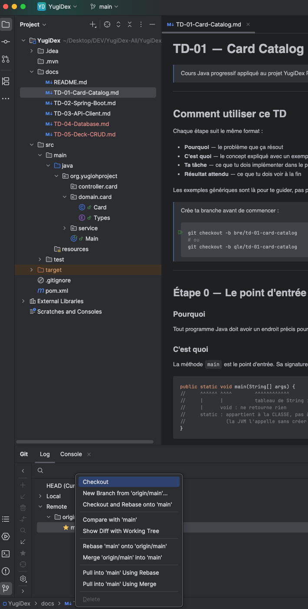
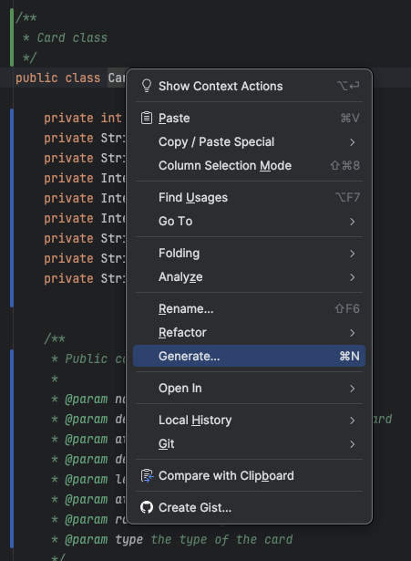
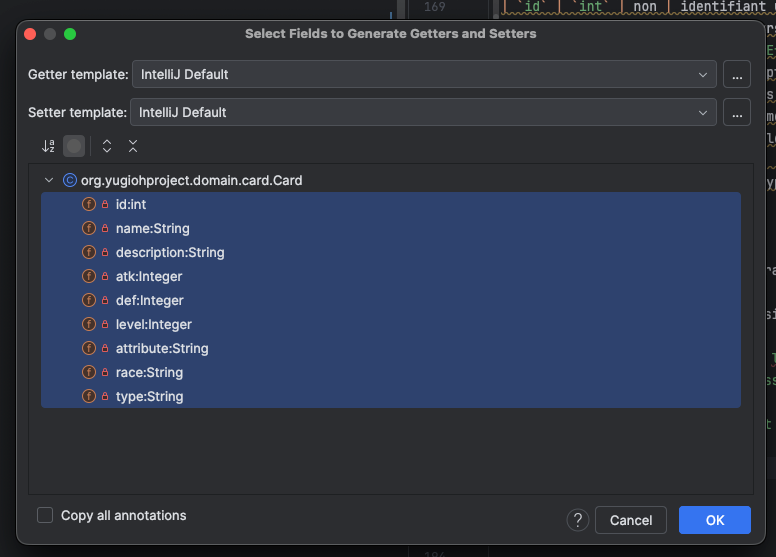

# TD-01 — Card Catalog : les fondamentaux Java
> Cours Java progressif appliqué au projet YugiDex
> Package : `org.yugiohproject`

---

## Comment utiliser ce TD

Chaque étape suit le même format :
- **Pourquoi** — le problème que ça résout
- **C'est quoi** — le concept expliqué avec un exemple *générique* (pas YugiDex)
- **Ta tâche** — ce que tu dois implémenter dans le projet
- **Résultat attendu** — ce que tu dois voir à la fin

Les exemples génériques sont là pour te guider, pas pour te donner la réponse.
Lis-les, comprends le principe, puis applique-le à ton domaine.

> Crée ta branche avant de commencer :
> ```bash
> git checkout -b bre/td-01-card-catalog
> # ou
> git checkout -b qle/td-01-card-catalog
> ```



---

## Étape 0 — Le point d'entrée

### Pourquoi

Tout programme Java doit avoir un endroit précis pour démarrer. Sans ça, la JVM (Java Virtual Machine) ne sait pas par où commencer.

### C'est quoi

La méthode `main` est le point d'entrée. Sa signature est **exacte** et ne peut pas varier :

```java
public static void main(String[] args) {
//     ^^^^^^ ^^^^        ^^^^^^^^^^^^
//     |      |           tableau de String : arguments passés en ligne de commande
//     |      void : ne retourne rien
//     static : appartient à la CLASSE, pas à un objet
//              (la JVM l'appelle sans créer d'instance)
}
```

Pour afficher du texte dans la console :
```java
System.out.println("Bonjour !");   // affiche + retour à la ligne
System.out.print("Suite...");     // affiche SANS retour à la ligne

// Insérer des variables dans un texte :
String nom = "Alice";
int age = 30;
System.out.println("Bonjour " + nom + ", tu as " + age + " ans.");
// ou avec String.format (plus lisible pour plusieurs variables) :
System.out.println(String.format("Bonjour %s, tu as %d ans.", nom, age));
//                                         ^^        ^^
//                                         %s = String, %d = entier (decimal)
```

### La tâche

Crée `src/main/java/org/yugiohproject/Main.java` avec un point d'entrée valide.
Au démarrage, le programme doit afficher dans la console :

```
=== YugiDex démarré ===
```

### IntelliJ tips

| Action | Windows | Mac |
|--------|---------|-----|
| Créer un fichier Java | `Alt+Insert` dans l'arborescence | `Cmd+N` |
| Taper `psvm` puis `Tab` | génère `public static void main(String[] args)` | idem |
| Taper `sout` puis `Tab` | génère `System.out.println()` | idem |
| Lancer le programme | `Shift+F10` | `Ctrl+R` |

---

## Étape 1 — Modéliser une carte : la classe

### Pourquoi

On veut représenter des objets du monde réel (une carte Yu-Gi-Oh) dans le code.
En Java, on utilise une **classe** pour décrire la structure de ces objets.

### C'est quoi

#### Les champs et l'encapsulation

Un champ est une variable qui appartient à un objet. On les déclare `private` pour qu'on ne puisse pas les modifier librement depuis l'extérieur :

```java
public class Produit {
    private String nom;        // on ne peut pas écrire produit.nom = "..."
    private double prix;
    private int stock;
}
```

> **`private` vs `public`** : `private` = accessible uniquement dans cette classe.
> Si tout était `public`, n'importe qui pourrait écrire `produit.prix = -9999` — aucun contrôle.

#### Les types nullables

En Java, il y a une distinction importante :

```java
int nombre;      // type primitif, ne peut PAS être null, vaut 0 par défaut
Integer nombre;  // type objet (wrapper), PEUT être null
```

Règle simple : si la valeur peut être **absente** pour certains objets de la classe → utilise le type avec majuscule (`Integer`, `Double`...).

#### Le constructeur

Le constructeur est appelé à la création d'un objet (`new Produit(...)`). Il initialise les champs :

```java
public class Produit {
    private String nom;
    private double prix;

    public Produit(String nom, double prix) {
        this.nom = nom;    // "this.nom" = le champ de l'objet
        this.prix = prix;  // "nom" seul = le paramètre du constructeur
    }
}

// Utilisation :
Produit p = new Produit("Casque", 49.99);
```

#### Les getters

Les champs sont `private` → pour les lire depuis l'extérieur, on expose des méthodes de lecture (*getters*) :

```java
public String getNom()   { return nom; }
public double getPrix()  { return prix; }
```

Convention Java : `get` + nom du champ avec majuscule en premier.

#### `toString()`

Quand on affiche un objet avec `System.out.println(obj)`, Java appelle sa méthode `toString()`.
Sans la redéfinir, tu verras `Produit@7a5d012b` (comme on a vu lors du vocal discord : l'adresse mémoire, inutile).

```java
@Override  // on "remplace" la version par défaut héritée de Object
public String toString() {
    return "Produit{nom='" + nom + "', prix=" + prix + "}";
}
```

### La tâche

Crée `src/main/java/org/yugiohproject/card/Card.java`.

Une carte Yu-Gi-Oh possède ces informations (d'après l'API YGOProDeck) :

| Champ | Type | Peut être null ? | Raison |
|-------|------|-----------------|--------|
| `id` | `int` | non | identifiant unique toujours présent |
| `name` | `String` | non | toujours un nom |
| `type` | `String` | non | ex: `"Effect Monster"`, `"Spell Card"` |
| `desc` | `String` | non | description de la carte |
| `atk` | `Integer` | **oui** | les Sorts/Pièges n'ont pas d'ATK |
| `def` | `Integer` | **oui** | même raison |
| `level` | `Integer` | **oui** | les Sorts/Pièges n'ont pas de niveau |
| `attribute` | `String` | **oui** | les Sorts/Pièges n'ont pas d'attribut |
| `race` | `String` | non | sous-type (ex: `"Spellcaster"`, `"Dragon"`) |

Ta classe doit avoir :
1. Tous les champs en `private`
2. Un constructeur avec tous les paramètres
3. Un getter pour chaque champ
4. Un `toString()` lisible (tu choisis le format)

> **Première règle d’Uncle Bob :**
Tout objet **DOIT** savoir se raconter de manière lisible → implémente `toString()` dès que possible.

> **Tips pour générer les Getter et les Setter** : 
> Clique droit sur le nom de la classe -> Generate

> Séléctionner tous les attributs et cliquer sur générer 


**Attention à la javadoc**

Exemple de javadoc :

```java
/**
 * Classe Produit
 *
 * nom: nom du produit
 * prix : prix du produit
 * @author Bertrand2808 & Novatekfull
 */
public class Produit {
    private String nom;
    private double prix;

    /**
     *  Public constructor
     *  @param nom  the product name
     *  @param prix the product price
     */
    public Produit(String nom, double prix) {
        this.nom = nom;
        this.prix = prix;
    }
}
```

#### Vérifier ton travail

Dans `Main.java`, crée deux cartes manuellement et affiche-les :
- Un monstre : Dark Magician (id `89631139`, ATK 2500, DEF 2100, niveau 7, attribut DARK, race Spellcaster)
- Une carte magie : Pot of Greed (id `55144522`, pas d'ATK/DEF/niveau/attribut)

Résultat attendu (le format exact est le tien, l'essentiel est que les données soient là) :
```
Dark Magician [DARK] ATK:2500 DEF:2100 ★7
Pot of Greed
ATK de Dark Magician : 2500
ATK de Pot of Greed : null
```

### IntelliJ tips

| Action | Windows | Mac |
|--------|---------|-----|
| Générer getters/constructeur | `Alt+Insert` dans la classe | `Cmd+N` |
| Formater le code | `Ctrl+Alt+L` | `Cmd+Alt+L` |
| Voir les paramètres d'une méthode | `Ctrl+P` dans les parenthèses | `Cmd+P` |
| Aller à la déclaration | `Ctrl+B` ou `F12` | `Cmd+B` |


**Ne pas oublier de commit à la fin de l'étape 1**

---

## Étape 2 — Les Enums : types sûrs

### Pourquoi

Le champ `type` est actuellement un `String` libre. Rien n'empêche d'écrire `"Monstre"` au lieu de `"Effect Monster"` — c'est un bug silencieux difficile à détecter.

```java
// Problème :
card.getType().equals("Effect Monster")  // ✓ correct
card.getType().equals("effect monster")  // ✗ faux, mais pas d'erreur de compilation
card.getType().equals("Monstre Effet")   // ✗ faux aussi
```

### C'est quoi

Un `enum` est un type qui ne peut valoir qu'un des cas que tu as listés. Toute valeur non définie est une **erreur de compilation** — le bug est détecté avant même de lancer le programme.

```java
// Exemple générique : les saisons
public enum Saison {
    PRINTEMPS,
    ETE,
    AUTOMNE,
    HIVER
}

// Utilisation :
Saison s = Saison.ETE;       // ✓
Saison s = Saison.MATIN;     // ERREUR DE COMPILATION ← le bug est détecté immédiatement
Saison s = "Été";            // ERREUR DE COMPILATION ← un String n'est pas une Saison
```

#### Méthodes utiles

```java
Saison s = Saison.AUTOMNE;

s.name()     // "AUTOMNE" (le nom de la constante, toujours en MAJUSCULES)
s.ordinal()  // 2 (position dans la liste, commence à 0)

// Switch sur enum (Java 14+)
String label = switch (s) {
    case PRINTEMPS -> "Spring";
    case ETE       -> "Summer";
    case AUTOMNE   -> "Fall";
    case HIVER     -> "Winter";
    // Pas de "default" nécessaire : tous les cas sont couverts
};
```

#### Enum avec champs

Un enum peut avoir des données attachées à chaque constante :

```java
public enum Planete {
    MERCURE(3.303e+23, 2.4397e6),
    VENUS(4.869e+24,   6.0518e6),
    TERRE(5.976e+24,   6.37814e6);
    //      ^masse         ^rayon

    private final double masse;
    private final double rayon;

    // Constructeur de l'enum (toujours private, implicitement)
    Planete(double masse, double rayon) {
        this.masse = masse;
        this.rayon = rayon;
    }

    public double getMasse() { return masse; }
    public double getRayon() { return rayon; }
}
```

### La tâche

Crée deux enums dans le package `card/` :

**`CardType`** — les types de cartes Yu-Gi-Oh :
- Monstres : Normal, Effect, Ritual, Fusion, Synchro, XYZ, Link
- Sorts et pièges : Spell Card, Trap Card

**`CardAttribute`** — les attributs (uniquement pour les monstres) :
- DARK, LIGHT, FIRE, WATER, EARTH, WIND, DIVINE
- Chaque constante doit avoir un label en français (`"TÉNÈBRES"`, `"LUMIÈRE"`, etc.)

Ensuite, **modifie `Card`** pour utiliser ces enums à la place des `String type` et `String attribute`.

#### Vérifier ton travail

Dans `Main.java`, crée une carte en utilisant les enums et affiche son attribut en français :

```
Exodia the Forbidden One — attribut : TÉNÈBRES
```

---

## Étape 3 — Le Record : immuabilité sans boilerplate

### Pourquoi

La classe `Card` avec 9 champs, son constructeur à 9 paramètres, ses 9 getters, `toString()`, `equals()`, `hashCode()` fait ~80 lignes de code **répétitif et sans logique**. C'est du bruit.

Java 16 a introduit les **records** pour ce cas précis : des classes de données immuables, sans boilerplate.

*Lien*: [Documentation Record](https://www.baeldung.com/java-record-keyword)

### C'est quoi

```java
// Avant (classe classique) :
public class Point {
    private final int x;
    private final int y;

    public Point(int x, int y) { this.x = x; this.y = y; }
    public int getX() { return x; }
    public int getY() { return y; }
    // + toString(), equals(), hashCode()... ~40 lignes
}

// Après (record) :
public record Point(int x, int y) {}
// ~1 ligne, même résultat !
```

Un record génère automatiquement :
- Un constructeur avec tous les paramètres
- Des accesseurs nommés comme les champs : `point.x()`, `point.y()` (sans `get`)
- `toString()`, `equals()`, `hashCode()`
- Tous les champs sont **`final`** : on ne peut plus les modifier après création

```java
Point p = new Point(3, 4);
System.out.println(p.x());   // 3  (pas getX() !)
System.out.println(p);       // Point[x=3, y=4]  (toString() automatique)
p.x = 10;                    // ERREUR DE COMPILATION : final !
```

#### Valider les données à la création

Le **compact constructor** permet de valider sans répéter les paramètres :

```java
public record Point(int x, int y) {
    public Point {  // même nom que le record, sans parenthèses
        if (x < 0 || y < 0) {
            throw new IllegalArgumentException("Les coordonnées doivent être positives");
        }
        // On peut aussi transformer les données ici :
        // x = Math.abs(x);  // forcer positif
    }
}
```

### La tâche

Transforme la classe `Card` en **record**.

Points d'attention :
- Les accesseurs changent de nom : `card.getName()` → `card.name()`, `card.getAtk()` → `card.atk()`
- Ajoute une validation dans le compact constructor : `name` ne peut pas être null ni vide
- Supprime le `toString()` que tu avais écrit — le record en génère un automatiquement (vérifie s'il te convient)

Met à jour `Main.java` pour utiliser la nouvelle syntaxe d'accesseur.

> **IntelliJ tip** : si tu modifies la signature d'une méthode, `Shift+F6` sur le nom de la méthode renomme toutes les occurrences en même temps.

---

## Étape 4 — Le Repository : séparer l'accès aux données

### Pourquoi

Pour l'instant, `Main.java` crée des cartes à la main. Plus tard, elles viendront d'une API (YGOProDeck) ou d'une base de données. Si on mélange "comment accéder aux données" et "quoi faire avec", le code devient impossible à changer sans tout casser.

#### Explications

C’est un principe **très central** de Clean Architecture (et d’autres architectures similaires comme Hexagonal / Ports & Adapters).

En gros, on parle de **séparation des préoccupations** + **règle de dépendance** (Dependency Rule) :
**Le code qui contient les vraies règles métier ne doit JAMAIS savoir d’où viennent les données ni comment elles sont stockées.**

##### Analogie e-commerce ultra-simple (magasin de vêtements)

Imagine que tu tiens un magasin de fringues :

Tu as 3 zones bien séparées :

1. **La caisse + le stock en arrière-boutique**
   = la partie « données » (base de données, API externe, fichier Excel, Shopify, Amazon Seller, etc.)

2. **Le cerveau du patron** (les vraies règles du business)
   Exemples de règles métier :
   - Un t-shirt taille M coûte 25 €, mais -20 % si la personne achète plus de 3 articles
   - La livraison est gratuite à partir de 80 € d’achat
   - Panier maximum 10 articles par commande (anti-revendeurs)

3. **La vendeuse à l’accueil** (interface utilisateur : site web, appli mobile, caisse en magasin)
   C’est elle qui parle au client, affiche les prix, ajoute au panier, valide la commande.

Maintenant la règle d’or (ce que Clean Architecture protège à mort) :

**Le cerveau du patron (les règles métier) n’a pas le droit de savoir si le stock est dans un classeur Excel, dans Shopify, dans une base PostgreSQL ou chez un fournisseur via une API chinoise.**

Pourquoi c’est hyper important ?

Scénario catastrophe (ce qu’on veut éviter) :

Imagine un code où tout est mélangé comme ça :

```java
// Dans le même fichier / même fonction
if (client.achète("t-shirt M")) {
    prix = 25;
    if (client.achètePlusDe(3)) prix = prix * 0.8;

    // ← ici on mélange déjà métier + technique
    stockRestant = excelFile.readLigne("TshirtM").quantite;   // Excel aujourd'hui
    // ou plus tard :
    stockRestant = shopifyApi.getStock("SKU-45678");
    // ou :
    stockRestant = bdd.sql("SELECT qty FROM products WHERE id=123");

    if (stockRestant > 0) {
        client.ajouteAuPanier();
        // etc.
    }
}
```

→ Si demain il change de fournisseur (Shopify → WooCommerce → PrestaShop → base locale),
il doit **toucher à toutes les règles métier** pour changer 3 lignes de lecture de stock.
→ C’est long, risqué, plein de bugs possibles.

##### La bonne façon (Clean Architecture style)

On sépare en couches qui ne se connaissent pas dans le mauvais sens :

- Le **cerveau du patron** (Entités + Use Cases / règles métier) dit seulement :
  « J’ai besoin de savoir combien il reste de t-shirts M »
  → Il parle à une **interface** abstraite : `StockRepository.demanderQuantite("TshirtM")`

- Il **ne sait jamais** si derrière c’est :
  - un appel API
  - une base de données
  - un fichier
  - un cache Redis (voir [Définition Redis](https://aws.amazon.com/fr/elasticache/what-is-redis/#:~:text=Redis%20propose%20un%20ensemble%20de,pub%2Fsub%20et%20les%20classements.))
  - un appel à un autre service

- La vendeuse (site web / appli) appelle le cerveau :
  « Patron, Kevin veut 2 t-shirts M et 1 jean, calcule-moi le prix et dis-moi si c’est possible »

- Le patron répond sans jamais parler technique.

Demain, quand tu changes tout ton stock vers une nouvelle API ultra-rapide :

→ Il change **seulement** la classe qui implémente `StockRepository`
→ Il touche **0 ligne** dans les règles de prix, promo, limite panier, etc.

C’est exactement ce qui se passe dans le projet Yu-Gi-Oh :

Aujourd’hui tu crées les cartes à la main dans `Main.java`
Demain elles viendront de YGOProDeck API ou d’une base de données.

Si tu mélanges :

- « créer une carte »
- « appeler l’API YGOProDeck »
- « parser le JSON »
- « gérer les erreurs réseau »

→ quand tu changeras de source (API → base locale → autre API), tu devras réécrire une partie de ton code métier (genre calcul de puissance, effets, etc.).

**Clean Architecture** dit :

« Mets tes vraies règles Yu-Gi-Oh (comment on calcule la puissance, comment on applique un effet, qui gagne un duel, etc.) au centre, dans des classes qui ne connaissent **jamais** l’API, la base de données, ni même le format JSON. »

Et c’est pour ça qu’on crée des interfaces comme `CarteRepository` :
Le code métier dit juste « donne-moi une carte par son nom ou son id », sans savoir d’où elle vient.

**Le pattern Repository** : une couche dédiée uniquement à l'accès aux données.

```
Qui utilise les données → CardService
Qui accède aux données → CardRepository
Où sont les données    → MockCardRepository (maintenant) → ApiCardRepository (plus tard)
```

Changer la source de données = changer l'implémentation du repository, **sans toucher au reste**.

### C'est quoi le `Repository Pattern` ?

**La phrase à retenir :**
On sépare **ce qu'on veut faire avec les données** (le contrat) de **comment on accède vraiment aux données** (la base, l'API, un mock, un fichier...).

#### L'interface : le contrat

Une interface définit **ce qu'on peut faire** sans dire **comment** :

```java
// Exemple générique
public interface ProduitRepository {
    List<Produit> findAll(); // Récupérer tous les produits
    Optional<Produit> findById(int id); // Trouver un produit par son id
    List<Produit> findByNom(String nom); // Trouver un produit par son nom
    // On peut ajouter save(Produit p), delete(Produit p), etc.
}
```

> Une interface ne contient que des signatures de méthodes, pas de corps (pas de code exécutable). C'est comme un menu de restaurant : **on voit ce que l'on eut commander, pas la recette**.
> Toute classe qui "implements" cette interface est obligée d'implémenter ces méthodes.

#### L'implémentation : le comment

L'implémentation est la classe qui va contenir le code exécutable des méthodes définies dans l'interface.

```java
public class MockProduitRepository implements ProduitRepository {

    private static final List<Produit> CATALOGUE = List.of(
        new Produit(1, "Casque", 49.99),
        new Produit(2, "Clavier", 89.99)
    );

    @Override
    public List<Produit> findAll() {
        return CATALOGUE;
    }

    @Override
    public Optional<Produit> findById(int id) {
        return CATALOGUE.stream()
            .filter(p -> p.id() == id)
            .findFirst();
        // findFirst() retourne Optional<Produit> :
        // présent si trouvé, vide (Optional.empty()) si non trouvé
    }

    @Override
    public List<Produit> findByNom(String nom) {
        return CATALOGUE.stream()
            .filter(p -> p.nom().toLowerCase().contains(nom.toLowerCase()))
            .toList();
    }
}
```

Le code **Métier** utilisera toujours l'interface `ProduitRepository`, jamais la classe concrète (l'implémentation).

#### Optional : remplacer `null`

`Optional<T>` signale explicitement qu'une valeur peut être absente :

```java
Optional<Produit> resultat = repo.findById(999);

// ✗ À ne pas faire : crash si vide
Produit p = resultat.get();

// ✓ Vérifier avant
if (resultat.isPresent()) {
    System.out.println(resultat.get().nom());
}

// ✓ Action si présent
resultat.ifPresent(p -> System.out.println(p.nom()));

// ✓ Valeur par défaut si absent
Produit p = resultat.orElse(new Produit(0, "Inconnu", 0));

// ✓ Exception si absent (le plus courant)
Produit p = resultat.orElseThrow(() -> new RuntimeException("Produit introuvable"));
```

### La tâche

**1. Crée l'interface** `src/main/java/org/yugiohproject/card/CardRepository.java` avec ces méthodes :
- `findAll()` → toutes les cartes
- `findById(int id)` → une carte ou rien (`Optional`)
- `findByName(String partialName)` → recherche partielle insensible à la casse
- `findByType(CardType type)` → cartes d'un type donné
- `findByAttribute(CardAttribute attribute)` → cartes d'un attribut donné

**2. Crée l'implémentation** `MockCardRepository.java` avec **au minimum 6 cartes** en dur :
- Quelques monstres de types et attributs variés (ex: Dark Magician, Blue-Eyes, Exodia...)
- Au moins une carte Magie et une carte Piège

**3. Mets à jour `Main.java`** pour instancier le repository et appeler chaque méthode. Vérifie que :
- `findAll()` retourne bien tes cartes
- `findById()` sur un ID existant retourne la carte, sur un ID inconnu retourne `Optional.empty()`
- `findByName("Dragon")` retourne les cartes dont le nom contient "Dragon"

> **IntelliJ tip** — implémenter une interface :
> Crée la classe `MockCardRepository implements CardRepository`, puis `Alt+Enter` sur le nom
> de la classe → `Implement methods` → sélectionne tout → génère les méthodes vides à compléter.

---

## Étape 5 — Premiers tests unitaires

### Pourquoi cette étape ?

Comment savoir que ton `MockCardRepository` se comporte correctement ? Pour l'instant tu l'appelles dans `Main.java` et tu regardes la console. C'est manuel, pas reproductible, et tu dois re-vérifier à chaque modification.

Un **test unitaire** automatise cette vérification. Il s'exécute en quelques millisecondes, en permanence, et te dit immédiatement si tu as cassé quelque chose.

### La partie cours : `Les Tests Unitaires`

#### C'est quoi un test unitaire ?

Un test unitaire = un petit programme automatique qui vérifie qu’**une seule petite partie** de ton code (une méthode, une fonction) fait **exactement** ce qu’elle est censée faire.

On teste **une boîte noire** :

- On ne regarde **pas** à l’intérieur de la méthode (on s’en fiche comment elle est codée)
- On donne seulement des **entrées** (Given)
- On attend une **sortie précise** (Then)
- Et on décrit **ce qui se passe** entre les deux (When)

C’est le style **Given-When-Then** (très utilisé en BDD / Behavior Driven Development, même pour les unit tests).

Exemple concret (e-commerce) :

```java
// La méthode qu'on veut tester (dans une classe ProduitService)
public double calculerPrixAvecPromo(double prixBase, int quantite) {
    if (quantite >= 3) {
        return prixBase * quantite * 0.8; // -20%
    }
    return prixBase * quantite;
}
```

| Avantage | Explication simple | Impact réel sur le projet |
|----------|------------------|-------------------------|
| Confiance | Tu sais que ta méthode marche aujourd’hui… et qu’elle marchera encore demain | Moins de peur de casser le code quand tu modifies |
| Détection rapide des bugs | Le bug est trouvé en quelques secondes (pas en prod chez le client) | Gain de temps énorme |
| Documentation vivante | Le test montre comment la méthode doit être utilisée (mieux que des commentaires) | Nouveau dev lit les tests → il comprend vite |
| Refactoring sans peur | "Tu peux réécrire le code (optimiser, cleaner) → les tests te disent si tu as cassé quelque chose" | Code propre et maintenable sur des années |
| Vitesse de développement | Tu testes en continu → tu avances plus vite car tu n’as pas à vérifier manuellement | Productivité ↑ |
| Moins de regressions | "Quand tu ajoutes une nouvelle fonctionnalité, les anciens tests protègent l’existant" | Moins de "ça marchait avant, pourquoi plus maintenant ?"

#### Comment on construit un test, étape par étape (timeline de réflexion)

On va écrire **le même test** en 3 versions successives, comme si on le construisait en direct.

**Cas à tester** : quand on achète 4 articles, on doit avoir -20 % (remise appliquée).

##### Étape 1 : On commence par la FIN — ce qu’on sait déjà (l’attendu)

On écrit d’abord le **nom du test** + le **Then** (ce qu’on veut comme résultat).

```java
@Test
void should_apply_20_percent_discount_when_buying_4_items() {
    // Given
    // (rien pour l’instant – on ne sait pas encore les entrées)

    // When
    // (pas encore – on ne sait pas comment appeler)

    // Then → on sait déjà ce qu’on veut !
    // 25 € × 4 × 0.8 = 80 €
    assertEquals(80.0, prixFinal);   // ← on met même une variable qui n’existe pas encore
}
```

>→ À ce stade, le code ne compile même pas → c’est **NORMAL**.
On force la réflexion : « Qu’est-ce que je veux exactement comme résultat ? »

##### Étape 2 : On ajoute les entrées (Given)

Maintenant qu’on sait ce qu’on veut, on se demande : « Avec quelles valeurs est-ce que j’obtiens ce résultat ? »

```java
@Test
void should_apply_20_percent_discount_when_buying_4_items() {
    // Given – maintenant on sait quoi mettre
    double prixBase = 25.0;
    int quantite = 4;

    // When
    // (toujours pas – on va le faire juste après)

    // Then
    assertEquals(80.0, prixFinal);   // ← toujours la même attente
}
```

> → On voit que le test commence à prendre forme.
On a le contexte (Given) et l’attente (Then), il manque juste l’action.

##### Étape 3 : On complète avec l’action (When) — on appelle la vraie méthode

Dernière étape : on branche tout ensemble.

```java
@Test
void should_apply_20_percent_discount_when_buying_4_items() {
    // Given – contexte de départ
    double prixBase = 25.0;
    int quantite = 4;

    // When – l’action qu’on teste vraiment
    double prixFinal = service.calculerPrixAvecPromo(prixBase, quantite);

    // Then – ce qu’on attend
    assertEquals(80.0, prixFinal, 0.001); // tolérance 0.001 pour les doubles
}
```

> → Et là, boum, le test compile et peut être exécuté !
C’est souvent dans cet ordre que les bons développeurs écrivent leurs tests : Then → Given → When.

Et on peut (et on DOIT) également le faire pour les cas où on teste des exceptions, des erreurs, pour s'assurer que effectivement si une erreur se produit, le code est correctement géré et ne laisse rien au hasard !

#### Le test en pratique

##### JUnit 5

`JUnit 5` est une dépendance que l'on ajoute dans le `pom.xml` et qui permet de tester le code.

```xml
<dependencies>
    <dependency>
        <groupId>org.junit.jupiter</groupId>
        <artifactId>junit-jupiter</artifactId>
        <version>5.11.3</version>
        <scope>test</scope>
        <!-- scope test : compilé et exécuté uniquement en test, pas en prod -->
    </dependency>
</dependencies>

<build>
    <plugins>
        <plugin>
            <groupId>org.apache.maven.plugins</groupId>
            <artifactId>maven-surefire-plugin</artifactId>
            <version>3.5.2</version>
            <!-- Surefire 3.x+ détecte JUnit 5 automatiquement -->
        </plugin>
    </plugins>
</build>
```

##### Structure d'un test

```java
// Les fichiers de test vont dans src/test/java/ (même structure de packages que src/main/)
// Convention : NomDeLaClasse + Test
class ProduitRepositoryTest {

    @Test  // ← cette méthode est un test
    void findById_returnsProduct_whenIdExists() {
        // Règle de nommage : ce_qu_on_teste__résultat_attendu__condition
        // Exemple : findById_returnsEmpty_whenIdNotFound

        // ARRANGE : préparer les données
        ProduitRepository repo = new MockProduitRepository();

        // ACT : exécuter ce qu'on teste
        Optional<Produit> result = repo.findById(1);

        // ASSERT : vérifier le résultat
        assertTrue(result.isPresent(), "Le produit doit être trouvé");
        assertEquals("Casque", result.get().nom(), "Le nom doit correspondre");
    }

    @Test
    void findById_returnsEmpty_whenIdNotFound() {
        ProduitRepository repo = new MockProduitRepository();

        Optional<Produit> result = repo.findById(9999);

        assertTrue(result.isEmpty(), "Ne doit rien trouver pour un ID inexistant");
    }
}
```

**Les assertions les plus courantes** :
```java
// Vérifier l'égalité (expected en premier, actual en second — convention)
assertEquals(42, result);
assertEquals("Dragon", card.name());

// Vérifier les collections
assertFalse(list.isEmpty());
assertEquals(3, list.size());
assertTrue(list.contains(expectedCard));

// Vérifier les Optional
assertTrue(optional.isPresent());
assertTrue(optional.isEmpty());

// Vérifier qu'une exception est lancée
assertThrows(RuntimeException.class, () -> repo.findById(-1));
```

##### Le Coverage

- Coverage = pourcentage de lignes / branches de code qui sont exécutées par au moins un test.
- Objectif réaliste : 70–90 % sur le code métier important (pas besoin de 100 % partout).
- IntelliJ montre le coverage directement :
    - Lignes vertes = testées
    - Lignes rouges = non testées

#### Tips Intellij

| Action | Windows / Linux | macOS | Commentaire |
|--------|-----------------|-------|-------------|
| Créer une classe de test pour une classe | Ctrl + Shift + T | ⌘ + Shift + T | Place le curseur dans la classe → génère le test |
| Aller du code au test (et inversement) | Ctrl + Shift + T | ⌘ + Shift + T | Super pratique |
| Générer une méthode de test | Alt + Insert → Test Method | ⌘ + N → Test Method | Dans la classe de test |
| Lancer TOUS les tests du fichier actuel | Ctrl + Shift + F10 | Ctrl + Shift + R  ou  ⌘ + Shift + R | Curseur dans la classe test |
| Lancer UN seul test (méthode) | Clic droit sur la méthode → Run  ou  Ctrl + Shift + F10 | Idem | Icône verte dans la gouttière aussi |
| Relancer le dernier test / config | Shift + F10 | Ctrl + R | Très rapide |
| Debug un test (pas à pas) | Shift + F9 | Ctrl + D | Mets un breakpoint avant |
| Voir le coverage | Run → Run with Coverage | Idem | Ou clic droit → Run with Coverage |
| Ouvrir le panneau des tests (Run window) | Alt + 4 | ⌘ + 4 | Voir les résultats |

### La tâche

Crée `src/test/java/org/yugiohproject/card/MockCardRepositoryTest.java`.

Écris au minimum ces tests :

1. `findAll_returnsAllCards` — vérifie que la liste n'est pas vide et contient le bon nombre de cartes
2. `findById_returnsCard_whenIdExists` — cherche un ID que tu as dans tes données mock
3. `findById_returnsEmpty_whenIdUnknown` — cherche un ID qui n'existe pas
4. `findByName_returnsMatchingCards` — `"Dragon"` doit trouver toutes tes cartes dont le nom contient "Dragon"
5. `findByName_isCaseInsensitive` — `"dragon"` (minuscule) doit donner le même résultat que `"Dragon"`
6. `findByType_returnOnlyRequestedType` — `findByType(CardType.SPELL_CARD)` doit retourner uniquement des sorts

#### Lancer les tests

```bash
mvn test
```

Dans IntelliJ : clic droit sur la classe de test → `Run 'MockCardRepositoryTest'`
Ou sur un seul test : clic droit sur la méthode → `Run`.

| Action | Windows | Mac |
|--------|---------|-----|
| Lancer les tests | `Ctrl+Shift+F10` sur la classe | `Ctrl+Shift+R` |
| Re-lancer les tests | `Shift+F10` | `Ctrl+R` |
| Générer un test depuis une classe | `Ctrl+Shift+T` | `Cmd+Shift+T` |

> **Tip** : IntelliJ affiche les tests en vert (passés) ou rouge (échoués). Un test rouge = une information précieuse. Lis le message d'erreur attentivement, il te dit exactement ce qui ne va pas.

---

## Étape 6 — Le Service : la logique métier

### Pourquoi on a besoin d’un Service ?
Le **Repository** sait **seulement accéder** aux données (lire, écrire, chercher).
Il ne doit **jamais** décider quoi faire avec : pas de calculs, pas de règles business, pas de combinaisons.

`Main` (ou plus tard un Controller) sait **ce que l’utilisateur veut faire**, mais pas **comment** le faire en détail.

→ C’est le rôle du **Service** :
Il orchestre la logique métier :
- Récupérer des données via le Repository
- Appliquer des règles business (filtres, calculs, validations, combinaisons)
- Retourner un résultat prêt à l’emploi

Schéma de flux (très important à retenir) :

```
Utilisateur / Main / Controller
↓
Appelle le Service   ← "Je veux la liste des produits en promo"
↓
ProduitService           ← Applique les règles : filtre promo + calcule prix final + trie
↓
ProduitRepository        ← Donne les données brutes
↓
Base / API / Mock        ← Source réelle
```


→ Avantages :
- Logique métier centralisée → facile à tester, à modifier
- Repository reste **très fin** (juste CRUD + queries simples)
- Main / Controller reste **très fin** (juste appelle le service)
- On peut changer la source de données sans toucher la logique business

### C'est quoi concrètement un Service ?

Un **Service** est une classe qui :
- Reçoit ses dépendances (comme le Repository) par le **constructeur** (injection de dépendances)
- Contient des méthodes qui représentent des **use cases** (actions métier complètes)
- Travaille **uniquement** avec l’**interface** du Repository (pas l’implémentation concrète)

#### Exemple e-commerce

```java
public class ProduitService {

    private final ProduitRepository repository;  // ← interface, pas la classe concrète !

    // Injection par constructeur (style moderne, testable, futur Spring)
    public ProduitService(ProduitRepository repository) {
        this.repository = repository;
    }

    // Use case : "Récupérer tous les produits en promotion"
    public List<Produit> getProduitsEnPromo() {
        // Logique métier ici
        List<Produit> tous = repository.findAll();

        return tous.stream()
                   .filter(p -> p.prix() < 50.0)          // règle business : promo si < 50 €
                   .sorted(Comparator.comparingDouble(Produit::prix))
                   .toList();
    }

    // Use case : "Ajouter au panier avec vérification stock + promo"
    public Panier ajouterAuPanier(int produitId, int quantite) {
        Optional<Produit> produitOpt = repository.findById(produitId);
        if (produitOpt.isEmpty()) {
            throw new ProduitNonTrouveException("Produit introuvable");
        }

        Produit p = produitOpt.get();
        // Logique métier : vérifier stock, appliquer promo si > 3, etc.
        // ...

        return new Panier(...);
    }
}
```

#### Point technique : Les Streams

Les Streams permettent de traiter des listes de façon fonctionnelle (sans boucles `for` explicites) :

```java
List<Produit> catalogue = repository.findAll();

// filter : garder uniquement les éléments qui vérifient la condition
List<Produit> pasChers = catalogue.stream()
    .filter(p -> p.prix() < 50.0)
    .toList();

// map : transformer chaque élément en autre chose
List<String> noms = catalogue.stream()
    .map(p -> p.nom())          // ou la référence de méthode : Produit::nom
    .toList();

// sorted : trier
List<Produit> parPrix = catalogue.stream()
    .sorted(Comparator.comparingDouble(Produit::prix))          // croissant
    // .sorted(Comparator.comparingDouble(Produit::prix).reversed()) // décroissant
    .toList();

// Enchaîner plusieurs opérations (le stream ne fait qu'un seul parcours)
List<Produit> resultat = catalogue.stream()
    .filter(p -> p.prix() < 100.0)
    .filter(p -> p.stock() > 0)
    .sorted(Comparator.comparingDouble(Produit::prix))
    .toList();

// Quelques opérations terminales utiles
long count = catalogue.stream().filter(p -> p.prix() > 50.0).count();
boolean any = catalogue.stream().anyMatch(p -> p.nom().contains("Pro"));
boolean all = catalogue.stream().allMatch(p -> p.stock() >= 0);
```

#### Grouper avec `Collectors`

```java
// Grouper les produits par catégorie
Map<String, List<Produit>> parCategorie = catalogue.stream()
    .collect(Collectors.groupingBy(Produit::categorie));

// Compter par catégorie
Map<String, Long> compteParCategorie = catalogue.stream()
    .collect(Collectors.groupingBy(Produit::categorie, Collectors.counting()));
```

### La tâche

Crée `src/main/java/org/yugiohproject/card/CardService.java`.

Le service reçoit un `CardRepository` dans son constructeur et expose ces méthodes :

1. `rechercherParNom(String nomPartiel)` — délègue au repository (mais tu peux y ajouter une validation : rejeter les recherches de moins de 2 caractères)
2. `getMonstresParForce()` — uniquement les cartes avec une ATK non nulle, triées par ATK décroissant
3. `getCartesParAttribut(CardAttribute attribut)` — toutes les cartes de cet attribut, triées par nom
4. `getStatistiquesParType()` — un `Map<CardType, Long>` comptant le nombre de cartes par type
5. `getTop3Monstres()` — les 3 monstres avec le plus d'ATK (utilise `limit(3)` sur un stream)

#### Vérifier dans Main.java

```
=== Recherche "Dragon" ===
3 résultats trouvés
Blue-Eyes White Dragon [LIGHT] ATK:3000...
...

=== Top 3 ATK ===
  Blue-Eyes White Dragon — 3000
  ...

=== Statistiques ===
NORMAL_MONSTER : 3 cartes
EFFECT_MONSTER : 2 cartes
...
```

#### Tests du service

Crée `CardServiceTest.java`. L'avantage de l'injection par constructeur : en test, tu passes directement le `MockCardRepository` sans Spring ni framework de mock :

```java
class CardServiceTest {

    private CardService service;

    @BeforeEach  // exécuté avant chaque test — réinitialise l'état
    void setUp() {
        CardRepository repo = new MockCardRepository();
        service = new CardService(repo);
    }

    @Test
    void getMonstresParForce_returnsOnlyMonstersWithAtk() {
        List<Card> monstres = service.getMonstresParForce();

        // Vérifier qu'il n'y a pas de Sort ou Piège dans la liste
        assertTrue(monstres.stream().allMatch(c -> c.atk() != null));
    }

    @Test
    void getMonstresParForce_isSortedByAtkDescending() {
        List<Card> monstres = service.getMonstresParForce();

        for (int i = 0; i < monstres.size() - 1; i++) {
            assertTrue(monstres.get(i).atk() >= monstres.get(i + 1).atk(),
                "Les monstres doivent être triés par ATK décroissante");
        }
    }

    // À toi d'écrire les tests pour rechercherParNom, getStatistiquesParType, etc.
}
```

---

## Récap des fichiers créés

```
src/
├── main/java/org/yugiohproject/
│   ├── Main.java                      ← Étape 0 : point d'entrée
│   └── card/
│       ├── CardType.java              ← Étape 2 : enum des 9 types
│       ├── CardAttribute.java         ← Étape 2 : enum des 7 attributs + label FR
│       ├── Card.java                  ← Étape 1→3 : record avec 9 champs + validation
│       ├── CardRepository.java        ← Étape 4 : interface (5 méthodes)
│       ├── MockCardRepository.java    ← Étape 4 : implémentation avec 6+ cartes
│       └── CardService.java           ← Étape 6 : logique métier + Streams
└── test/java/org/yugiohproject/
    └── card/
        ├── MockCardRepositoryTest.java ← Étape 5 : 6+ tests du repository
        └── CardServiceTest.java        ← Étape 6 : tests du service
```

---
